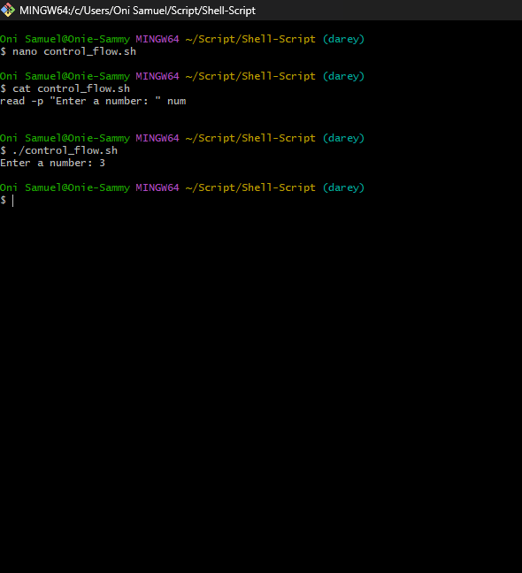
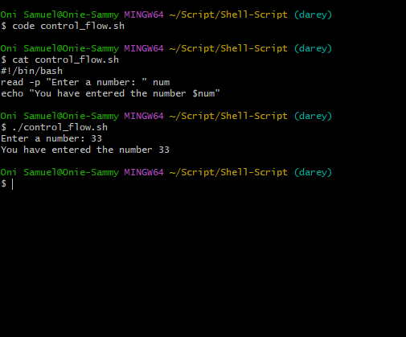
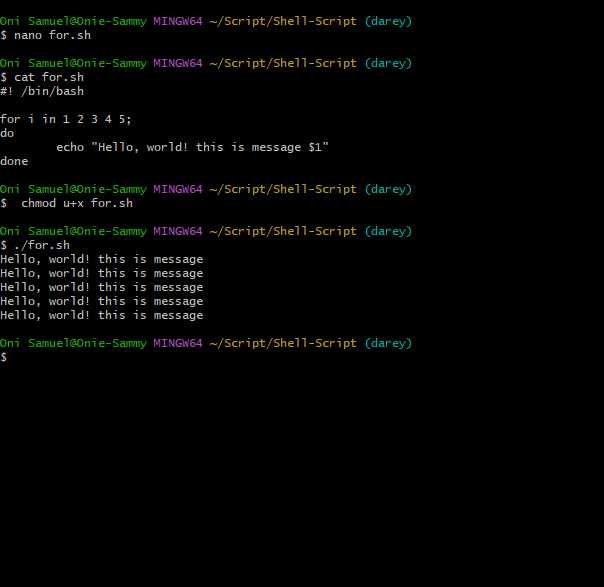

# Bash Scripting Documentation

This document explains three different Bash scripts. Each script
demonstrates a unique concept: conditional statements and loops.

------------------------------------------------------------------------

## 1. Script: Check if a Number is Positive, Negative, or Zero

### Code

``` bash
#!/bin/bash

# This script asks for a number and tells us if the number is positive, negative, or zero
read -p "Enter a number: " num

if [ $num -gt 0 ]; then
    echo "The number is positive."
elif [ $num -lt 0 ]; then
    echo "The number is negative."
else
    echo "The number is zero."
fi
```


### Explanation

-   **read -p "Enter a number:" num** → prompts the user for input.
-   **if / elif / else** → checks whether the input number is greater
    than, less than, or equal to zero.
-   **Comparison Operators**:
    -   `-gt` → greater than\
    -   `-lt` → less than\
    -   `-eq` → equal to

### Example Output

``` bash
$ ./number_check.sh
Enter a number: 5
The number is positive.
```

``` bash
$ ./number_check.sh
Enter a number: -2
The number is negative.
```

``` bash
$ ./number_check.sh
Enter a number: 0
The number is zero.
```

------------------------------------------------------------------------

## 2. Script: Print Message Using a For Loop (List of Numbers)

### Code

``` bash
#!/bin/bash

for i in 1 2 3 4 5;
do
     echo "Hello, world! this is message $i"
done
```


### Explanation

-   **for i in 1 2 3 4 5** → iterates through the values 1 to 5.\
-   **echo "Hello, world! this is message \$i"** → prints a message with
    the current iteration number.

### Example Output

``` bash
$ ./for_loop_list.sh
Hello, world! this is message 1
Hello, world! this is message 2
Hello, world! this is message 3
Hello, world! this is message 4
Hello, world! this is message 5
```

------------------------------------------------------------------------

## 3. Script: Print Numbers Using a C-Style For Loop

### Code

``` bash
#!/bin/bash

for (( i=0; i<7; i++ )); do
        echo "Number $i"
done
```

### Explanation

-   **for (( i=0; i\<7; i++ ))** → initializes `i` at 0, runs while
    `i < 7`, increments `i` by 1 each iteration.
-   **echo "Number \$i"** → prints the current value of `i`.

### Example Output

``` bash
$ ./for_loop_cstyle.sh
Number 0
Number 1
Number 2
Number 3
Number 4
Number 5
Number 6
```


----

## Key Takeaways

-   **Conditional Statements** (`if`, `elif`, `else`) allow
    decision-making in scripts.\
-   **For Loops** can be written in two forms:
    -   **List-based loop** → iterates over predefined values.\
    -   **C-style loop** → similar to loops in C, useful for ranges with
        initialization and increments.
