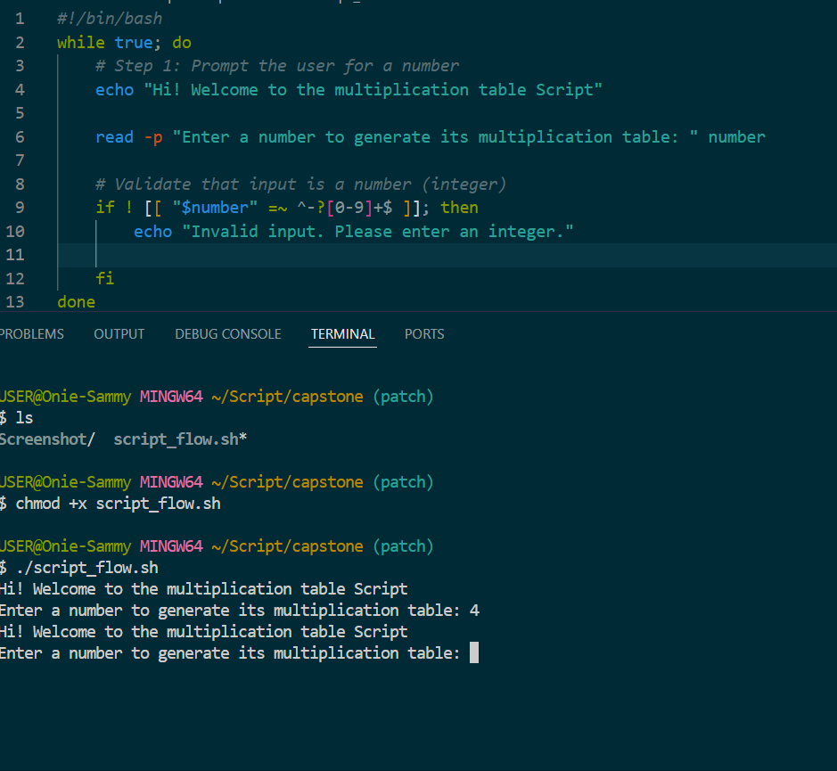
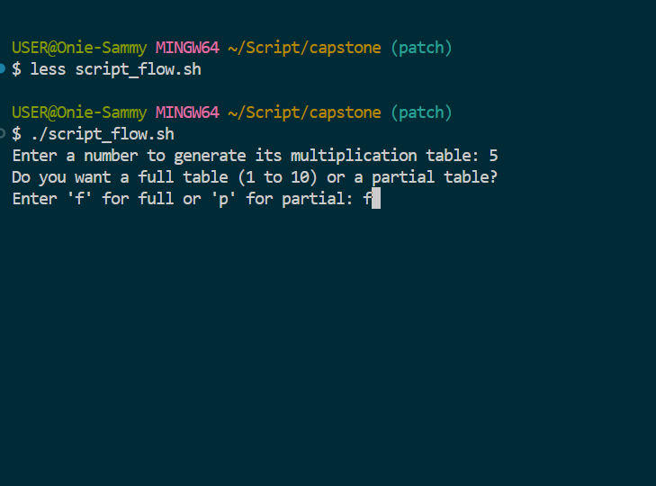
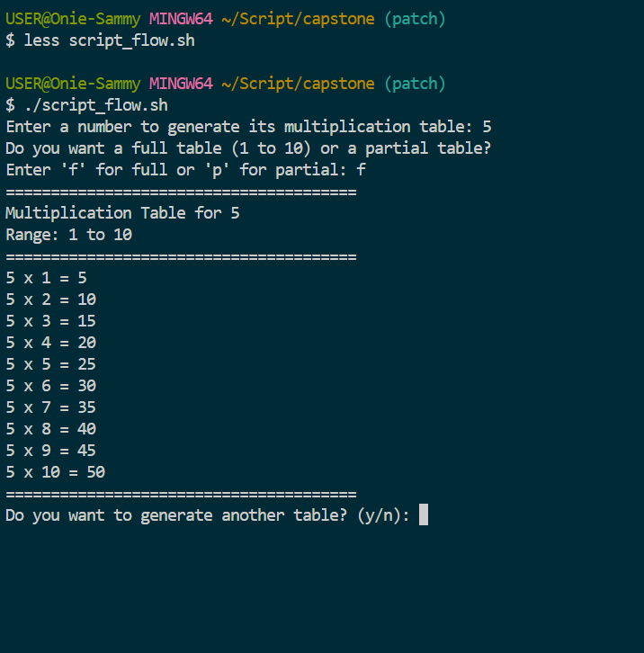
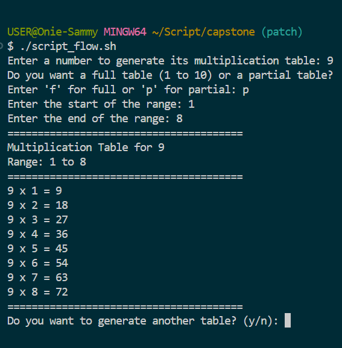

# 🖥️ Multiplication Table Generator (Bash Script)

This project is a **Bash script** that generates a multiplication table for a number entered by the user.  
It helps you practice **loops, conditional logic, user input handling, and validation** in shell scripting.

---

## 📖 Project Description

The script prompts the user to:
1. Enter a number for which the multiplication table will be generated.
2. Choose between:
   - A **full table** (1 to 10)  
   - A **partial table** (custom range)

It then validates the inputs and displays the table in a clean, formatted output.  
Additionally, the script allows the user to **repeat the process** without restarting the script.

---

## ⚙️ Features
- ✅ Accepts user input for the number.  
- ✅ Offers **full** (1–10) or **partial** (custom range) multiplication table.  
- ✅ Input validation:
  - Ensures number is valid.  
  - Ensures range is correct (start ≤ end, start ≥ 1).  
- ✅ Nicely formatted and easy-to-read output.  
- ✅ Bonus: User can generate multiple tables in one run.  

---

## 📝 How It Works
1. User enters a number.  
2. Script asks if they want a **full** or **partial** table.  
3. If **partial**, user provides start and end values.  
4. Script validates input:
   - Invalid input → defaults to **full table (1 to 10)**.  
5. Script prints the multiplication table using a loop.  
6. User can choose to generate another table or exit.  

---

## 📂 Example Usage

### Full Table (1 to 10)
```bash
Enter a number to generate its multiplication table: 5
Do you want a full table (1 to 10) or a partial table?
Enter 'f' for full or 'p' for partial: f
=======================================
Multiplication Table for 5
Range: 1 to 10
=======================================
5 x 1 = 5
5 x 2 = 10
5 x 3 = 15
...
5 x 10 = 50
=======================================
```
--------------








